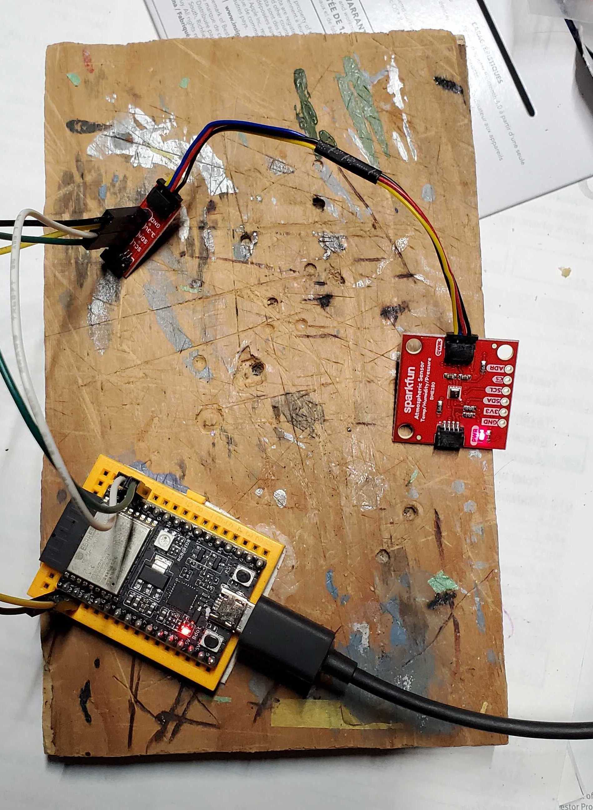

# Overview

A little home sensor project.
 
Fusing:

1. esp32 arduino with wifi.
2. BME280 - simple enviromentmental sensor, temperature, humidity, barometrics pressue.
3. some code to make it play nice with other data systems.

# Parts

* [ESP32-C3-DevKitC-02](https://docs.espressif.com/projects/esp-idf/en/latest/esp32c3/hw-reference/esp32c3/user-guide-devkitc-02.html)
* [SparkFun Atmospheric Sensor Breakout - BME280](https://www.sparkfun.com/products/13676)
* Neopixel ( on board on the esp32 board )
* Wires
* prototyping board.

# Plan / Design

* Use serial for diagnositc infomration on setup and error message.
* Get the esp32 board to run arduino ( The arduino IDE takes care of this transparently ).
* Get it to talk to the I2C BME 280 device.
* Get it to talk to the on-board neo pixel
* Get a basic web server setup.
* Write a handler for the /metrics endpoint where the sensor values are exposed. They are exposed in a way that means a prometheus server can collect them at regular intervals and squirrel the data way for otehr system to query , report, agregate, and graph. In this case I use grafana.

# Load some libraries:

Use arduino library manager to ensure these libraies are installed.

* Wire + SPI + [ Adafruit_BME280 ] ( https://github.com/adafruit/Adafruit_BME280_Library )
* [ Adafruit_NeoPixel ] ( https://github.com/adafruit/Adafruit_NeoPixel )
* Wifi WifiClient WebServer

# Picture

# Gotchas, Caveats & Tricks

## Onboard led

With other arduino boards there is a simple "set high" = one led "on board that you can use to given an indication of what's going on on your arduino run time.

With the ESP32-C3-DevKitC-02 the onboard led is infact a neopixel on pin 8 and with hand that as an option in the neopixel library setup.

Very handly IMHO.

##  I2C pins

Various Arduino boards have "default" I2C pins such that if you initialize the wire library with no options it "just works". It's not as clear with the ESP32-C3-DevKitC-02 board. The board was quite new at the time I got this setup and the docs said use pin 21 and 22, that didn't seem to work. So I wired up GPOI0 and GPOI1 and handed the wire.begin ( 0,1 ) that worked. The "official" arduino [wire] ( https://www.arduino.cc/en/reference/wire ) docs don't make it clear that you can set the pin that the arduino "talk" I2C. So that was a bit of a "gotcha".
